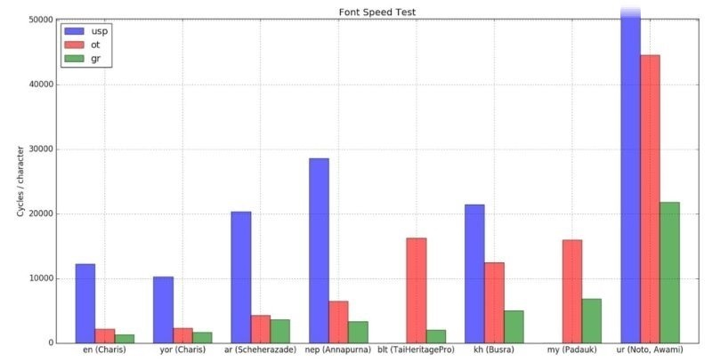
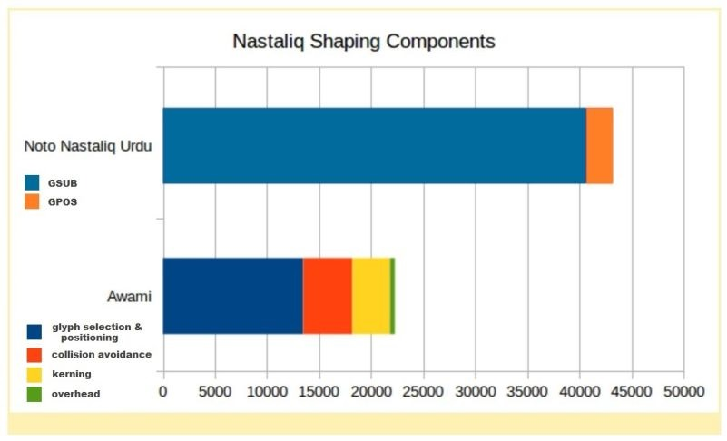

# Comparison of OpenType and Graphite shaping speeds in a Nastaliq context

_Martin Hosken, July 2017_

## Introduction

This paper examines the speed performance of OpenType and Graphite. For the most part we examine fonts that have similar processing features and have been implemented in both OpenType and Graphite. After a general discussion covering a number of fonts, the paper goes on to examine the implementation of two Arabic Nastaliq fonts.

For the most part, users do not perceive fonts as being too slow. But even a few milliseconds added to a page render time can affect user satisfaction. Many applications speed up rendering by caching the results of text shaping at the word level.

## Comparing Speeds

This graph shows the relative speed of various fonts and text in various scripts. In each case the font used is one that has both Graphite and OpenType tables aiming to have identical behaviour. The only exception is for Urdu where Noto Nastaliq Urdu is used for OpenType-based tests and Awami for the Graphite test.

The y-axis shows the time taken to shape the data and is expressed in cycles per character. The shorter the bar, the better. The cycles count comes from measuring the number of emulated cpu cycles, as measured by valgrind (callgrind) for the particular code used in shaping the text and dividing it by the number of characters to normalise for text length. Usp10 results are missing for TaiHeritagePro and Padauk due to failure in the test setup to load the font. Notice that the graph has been truncated slightly to enhance resolution; one result - usp10, ur (Noto) - has been cut off, for which the timing is is 83905 cycles/character.

The usp timings are not particularly helpful except to say that in the context of complex fonts, usp10 is not particularly snappy in comparison to other engines.

The tests are ordered left to right according to script processing complexity. The precise order is not formally defined or that important, but it does show that more complex scripts take longer to process. It also highlights the increased improvement in speed that Graphite provides as the complexity of the script processing increases. This is in contrast to the expectation that OpenType, due to handling more script complexity in code, should provide a greater benefit as the script becomes more complex. The contrast is highlighted by the fact that Padauk is doing full UTN#11 sequence checking in Graphite, which is not so strictly applied in the OpenType code. In addition, Awami is doing word kerning. Busra stands out in comparison to other Khmer fonts, as being significantly slower, because it too is doing strict sequence checking, both in OpenType and Graphite.The graph shows the time taken to shape text in various scripts using various engines. The three engines used are Uniscribe (usp10) from just before all shaping was done in DirectWrite; OpenType (ot - via harfbuzz; and Graphite (gr - via harfbuzz). Each cluster of 3 bars shows the timings for a paragraph from the Universal Declaration of Human Rights in a particular language. The language code is given along with the font used in the test. So, for example, nep (Annapurna) labels a test involving Nepali text and the Annapurna SIL font; or "ur (Noto, Awami)" labels a test involving Urdu text. The opentype engines (usp10 and harfbuzz) use the Noto Nastaliq Urdu font and the Graphite test uses Awami Nastaliq. For precise details of font versions see the appendix on testing details.

The likely cause for the slowness of complex OpenType fonts is that such fonts include a number of contextual lookups, which are particularly slow in OpenType processing. Graphite, on the other hand, is structured around contextual matching and so works particularly well with such fonts.

## Testing details

This section may be skipped without loss of understanding. It is included to provide extra detail on the testing procedure and full results data for those interested.

The tests were undertaken on a 64 bit Intel i7-4712HQ with Ubuntu 16.04, running valgrind (v3.11.0) and collecting results using callgrind. The timing results were then taken by examining the overall times for the following functions:

* ot: hb_shape_plan_execute
* graphite: gr_make_seg

For the usp10 test, harfbuzz (v1.4.5) was run under Wine (v1.8.5) using the Uniscribe shaper (usp10.dll, v1.0626.7601.17514). But since there are no debug symbols to reference functions by name, the timings were taken from an appropriate function call that shows no evidence of loading the font and then subtracting all the time taken to run GetCharABCWidthsI, which is a Wine function. Notice that within the function chosen, no other calls were made out to Wine, thus only usp10 code was executed. V1.3.10 of Graphite was used.

The raw test results are:

| Test | Font | usp10 | ot | graphite |
|:-----|:-----|:------|:---|:---------|
| en (Charis) | Charis SIL Regular v5.00 | 12272 | 2178 | 1310 |
| yor (Charis) | Charis SIL Regular v.500 | 10298 | 2311 | 1682 |
| ar (Scheherazade) | Scheherazade v2.100 | 20371 | 4292 | 3630 |
| nep (Annapurna) | Annapurna SIL v1.202 | 28584 | 6470 | 3378 |
| blt (TaiHeritagePro) | Tai Heritage Pro v2.500 |  | 16308 | 2010 |
| kh (Busra) | Khmer Busra v7.100 | 21478 | 12491 | 5045 |
| my (Padauk) | Padauk v3.004 |  | 16070 | 6863 |
| ur (Noto, Awami) | Noto Nastaliq Urdu v1.02, Awami Nastaliq preV1 v0.920 | 83907 | 44603 | 21827 |

Not all test strings are included, but the most useful example is the string used for the ur:

چونکہ انسانی حقوق سے لاپروایٔی اور ان کی بے حرمتی اکثر ایسے وحشیانہ افعال کی شکل میں ظاہر ہویٔی ہے جن سے انسانیت کے ضمیر کو سخت صدمے پہنچے ہیں اور عام انسانوں کی بلندترین آرزو یہ رہی ہے کہ ایسی دنیا وجود میں آیٔے جس میں تمام انسانوں کو اپنی بات کہنے اور اپنے عقیدے پر قایٔم رہنے کی آزادی حاصل ہو اور خوف اور احتیاج سے محفوظ رہیں،

## Special Challenges of Nastaliq

Arabic Nastaliq is, at its heart, Arabic. So why does a Nastaliq font take so much longer to process than a Naskh one (like Scheherazade)? There are two extra actions that a Nastaliq font needs to do in addition to the standard shaping of character forms and basic diacritic/nuqta attachment.

* The first is collision avoidance. Due to the sloping of the syllable, the horizontal space for a character is compressed and this greatly increases the likelihood that nuqtas will collide either with other nuqtas or with other base characters.
* The second action is word kerning. This moves words (or more strictly, clusters) closer together so that one word may finish underneath the start of another word.

There is another penalty that Nastaliq fonts incur as a result of word kerning. Word caches assume that the space between two words does not change based on the words involved. Word kerning adjusts the width of the space between two words based on the two words involved. This means that word caching cannot be applied to such text. Such a cache is often hit quite hard given that a piece of text will often be shaped multiple times for measuring purposes and line breaking before being rendered. The result is a slow font that cannot be cached. The need for speed in this context is paramount. The nature of the Arabic script makes it nearly impossible to find other boundaries in the text where sequences could be cached without interaction across the boundary.

We consider two fonts for comparison:

* Noto Nastaliq Urdu is a best of class OpenType font being fast, small and with a good coverage of both characters and supported sequences.
* Awami Nastaliq is a similar font in terms of speed, size and coverage.  Awami supports all the languages of Pakistan that use the Nastaliq style.

The key functionality difference between them is that Noto Nastaliq Urdu does not do word kerning, whereas Awami Nastaliq does.

The following graph shows how the two engines (Graphite as represented by Awami, and harfbuzz (OpenType) as represented by Noto Nastaliq Urdu) break down their processing time when shaping the test text. Shorter times are better. Note that the colours only function to show the different sub-timings. Which subtimings they correspond to are different for the two font shaping processes and are described in the following text.

Noto Nastaliq Urdu takes 44604 cycles/character to do its work. Of these, 40657 cycles are in GSUB (blue) and 2567 cycles in GPOS (orange). This might seem odd given that collision avoidance is about moving diacritics and nuqtas around. But Noto does most of this work in the GSUB table through the use of extra spacing glyphs to adjust the positioning of Nuqtas.

Awami is structured differently. It takes 22287 cycles/character to do its work. There is a data conversion overhead to convert the results from Graphite's internal form to fit Harfbuzz's structures. This takes 462 cycles/character (green) and is about the same for all right-to-left fonts. Collision avoidance takes 4739 cycles (red) and word kerning takes 3611 cycles (yellow). This leaves 13475 cycles (blue) for choosing the right glyphs and basic positioning. Notice this is considerably more than the 3630 cycles used in Scheherazade. So not only does a Nastaliq font have to deal with collision avoidance and word kerning, its basic shaping is far more complex than a Naskh font.

## Conclusion

The dramatic difference in speed between Awami Nastaliq and Noto Nastaliq Urdu demonstrates that reliance on a large number of OpenType complex contextual rules can considerably slow down shaping and rendering. Graphite’s alternate methods enable Awami Nastaliq to be much more efficient, even given its increased complexity. This speed benefit is not only applicable to extremely complex fonts, but is present through the full range of font complexity.

Word caching, when possible, can mitigate some of the slowdowns of complex fonts, however there are situations where word caching does not help:

* Cross-space contexts such as word kerning or even collision avoidance
* Where there are no word breaks, such as for some Southeast Asian scripts (Thai, Lao, Khmer, Burmese, and others)

The overall conclusion is that, in many situations, the value of an alternative to standard OpenType engines stands out, both in terms of functionality and performance. This value will grow as users demand fonts with increased complexity and greater support for sophisticated typography.
